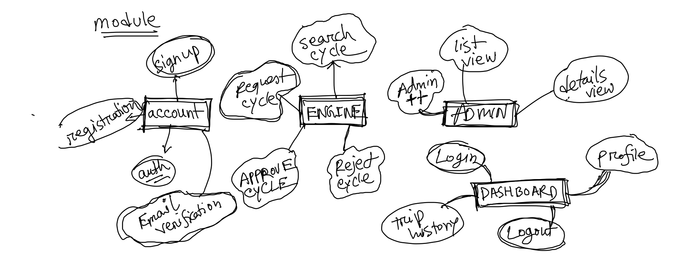
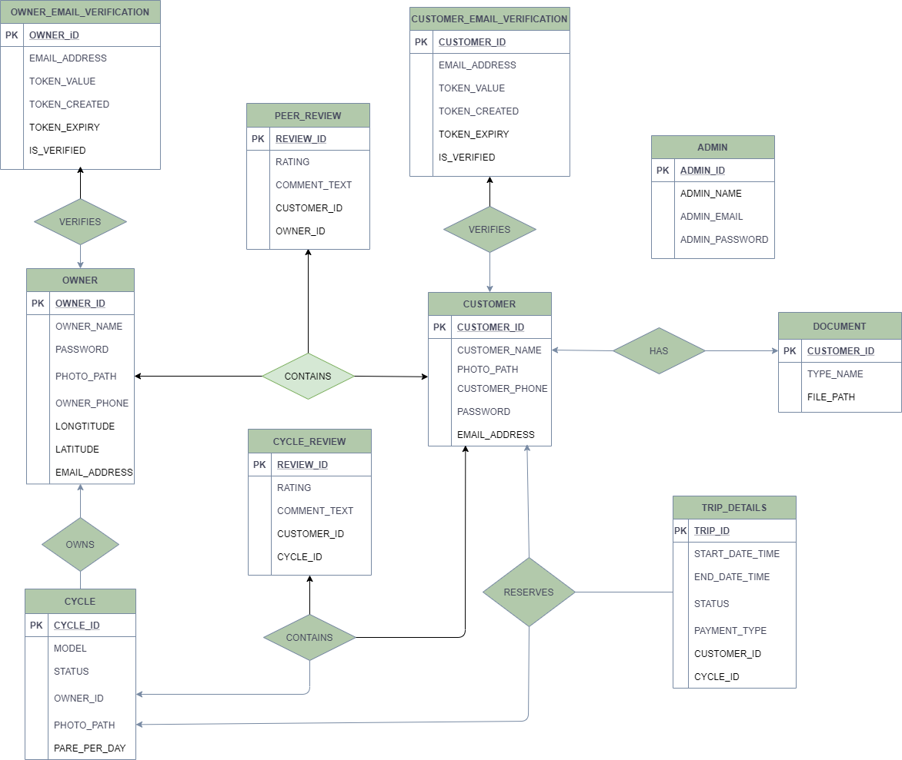
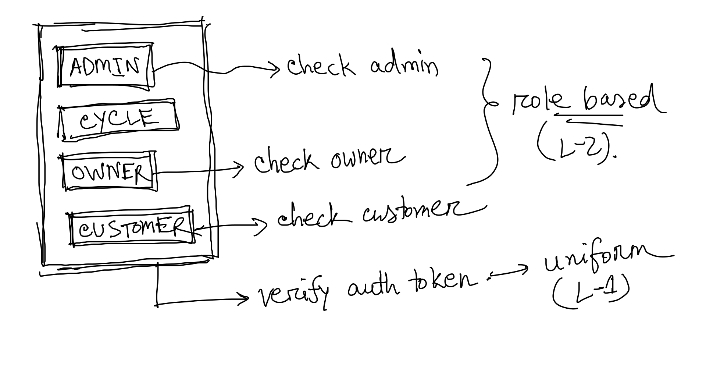

# Cycloan

Cycloan is a ride sharing platform where users can put up their cycles for renting it to others and vice versa. This was my project for Level 2 Term 2 CSE216 (Relational Database Management System Sessional) course. A working overview of this project can be found here: 

[](https://youtu.be/5lOaXUqJ86M)

In this project, I had @purbasha-nishat as my project partner and [Md. Saiful Islam](https://github.com/saiful1105020) Sir as our project supervisor. The motive behind this project was to design a RDBMS based system on using only raw SQL queries.

Django was the framework of our choice for this project and we weren't allowed to use any pre-built components of Django that relies on Django-Models. So, we had to **evolve backwards** while using this cutting-edge tools. As a result, we had to face quite a few challenges due to the limitation of this project. And yes, we did learn quite a few things.

In this write-up, all of those components has been explained for archive and futuristic purposes. Below contains a list of contents-

1. [Architecture](#architecture)
2. [Entity Relationship Diagram](#entity-relationship-diagram)
3. [Location Based Searching](#location-based-searching)
4. [Static Contents](#static-contents)
5. [Authentication](#authentication)
6. [Emailing](#emailing)

***

## Architecture
There are total six Django apps used for different purposes, some of them have been intertwined for usability purpose.

- Admin
- Core
- Cycle
- Customer
- Owner
- User



***

## Entity Relationship Diagram
Our project contains overall 10 database tables, 3 triggers, 3 functions and 3 procedures. The [PLSQL](PLSQL.sql) and [Schema](schema.sql) contains the SQL queries.



***

## Location Based Searching
We improved our searching system by introducing Google Maps API. Every time a customer has to search for cycle, they had to click their location on map and the backend would fetch the longtitude & latitude for the position.

The `map.js` file contains the main Google Map related code for the project. What that code does is, each time a webpage containing Google Map window starts, it loads it up with the given location in the map.

```javascript
var currentLocation = marker.getPosition();
document.getElementById('lat').value = currentLocation.lat();
document.getElementById('lng').value = currentLocation.lng();
```

After user puts the marker on the map, the `markerLocation()` method sets the longtitude and latitude value into two of our hidden input field. After user clicks the button to submit, the input field values are also submitted by a POST request.

```html
<div>
      <input type="hidden" id="lng" readonly="yes" name="longtitude">
      <input type="hidden" id="lat" readonly="yes" name="latitude">
</div>
```

### Nearby Searching Algorithm
During cycle search, we used [Haversine Formula](https://en.wikipedia.org/wiki/Haversine_formula) to calculate the distance between two points on earth. The code for calculating the distance is as below:

```python
def calculate_distance(baseLat, baseLong, pointLat, pointLong):

    baseLat = radians(baseLat)
    baseLong = radians(baseLong)
    pointLat = radians(pointLat)
    pointLong = radians(pointLong)

    radius = 6341
    dLat = baseLat - pointLat
    dLong = baseLong - pointLong

    a = sin(dLat/2)**2 + cos(baseLat) * cos(pointLat) * sin(dLong/2)**2
    curvature = 2*asin(sqrt(a))
    distance = curvature * radius
    
    return distance
```

The function returns the great-circle-distance between those two points in KM. And while showing our search results, we only kept those distances in a 5KM radius.

***

## Static Contents (Uploading)
The first and foremost trouble that we faced was saving a static file into the backend. Since, using django models weren't authorized, we had to look for a different way in. We were being able to receive the file submitted through the POST request and read it in main memory but couldn't find any way to write it in the existing file-system.

Also, we had uploaded it as BLOB into our database but fetching it from there and showing on the screen was a costly and time-consuming operation. So, we thought of saving it into our local directory and saving the path string in the database as VARCHAR.

Firstly, we named some constants in our `cycloan > settings.py` file for each file based on their use cases.

```python
OWNER_PHOTO_DIR = 'files/owner/photo/'
CYCLE_PHOTO_DIR = 'files/owner/cycle/'
CUSTOMER_PHOTO_DIR = 'files/customer/photo/'
CUSTOMER_DOC_DIR = 'files/customer/doc/'
```

This `files` directory here is created beforehand in our project's static directory, since all static contents are loaded from here. Then methods were written for each files to be renamed and saved so that the original filenames do not collide and overwrite each other.

```python
def save_customer_photo(photo, customer_id, contact):

    photo_ext = photo.name.split('.')[-1]
    photo_path = "".join([CUSTOMER_PHOTO_DIR, str(customer_id), '_', contact , '.', photo_ext])
    photo_static_path = "".join(["static/", photo_path ])
    photo_file = open(photo_static_path, 'wb')

    for chunk in photo.chunks():
        photo_file.write(chunk)
    photo_file.close()

    return photo_path
```

For example, this method takes an `InMemoryUploadedFile` object called photo, `int` type customer_id and `string` contact. The `InMemoryUploadedFile` is the one django receives through it's incoming POST request. Which looks something like this-

```python
photo = request.FILES.get('photo')
```

At first, the name of the file is splitted into two segments (name and extension). Then the file is renamed as **<customer_id>_<contact>.<extension>**. Then it's appended to `CUSTOMER_PHOTO_DIR` from `settings.py`. Since, it's saved in the **static** folder, the name appends it's parent directory and an empty file is created and opened in "byte mode".

Then the file data are written into the empty file and the relative path inside the static folder is returned. Then the path is stored into database table. There are several usage of such which can be found in-

- `customer > utils.py`
- `owner > utils.py`

***

## Authentication
In order to identify each users and their roles' uniquely, authentication was set up using sessions in Django. Be default, Django uses database backed sessions. Since we were running Oracle 11g and Django doesn't support that version, we had to make a few changes here and there.

First, we changed the session storage in `settings.py` file by overwriting the default config as such below:

```python
SESSION_ENGINE = "django.contrib.sessions.backends.signed_cookies"
SESSION_COOKIE_HTTPONLY = True
SESSION_COOKIE_AGE = 1209600
```

Here, we only approved HTTP cookies and set their age to 1209600 seconds (2 weeks). After setting up sessions, a few wrappers were created to give "specific access to specific user roles."



There were two layers of authentication for protected pages.

### Layer 1: Registered Members (Owner, Customer, Admin)
Only verifying the authentication key would suffice. So, the wrapper written in `core > utils.py` looks somewhat like this:

```python
def verify_auth_token(func):
    @wraps(func)
    def wrapped(self, request, *args, **kwargs):
        auth_token = request.session.get('auth_token')

        if not auth_token:
            messages.warning(request, 'Session expired. Please log in again.')
            return redirect('index-view')
        
        try:
            auth_data = jwt.decode(auth_token, SECRET_KEY, algorithms=['HS256'])
        except:
            messages.warning(request, 'Session expired. Please log in again.')
            return redirect('index-view')

        return func(self, request, *args, **kwargs)
    
    return wrapped
```

Point to note here is that, since we used class-based-view, there had to be four arguments for the `wrapped` method. For function-based-view, only the later three would suffice.

### Layer 2: Specific Role Based Members (Owner/Customer/Admin)

The role specified wrappers are written in `utils.py` file for admin, customer and owner apps.

```python
def check_customer(func):
    @wraps(func)
    def wrapped(self, request, *args, **kwargs):
        
        if request.session.get('user_type') == 'owner':
            messages.warning(request, 'You are not allowed to view that page.')
            return redirect('http-403-view')
        elif request.session.get('user_type') == 'admin':
            messages.warning(request, 'You are not allowed to view that page.')
            return redirect('http-403-view')

        return func(self, request, *args, **kwargs)
    return wrapped
```

We put up these wrappers only around those view-functions which are only allowed for customers only. If any different role based user tries to access them, they would get redirected to an HTTP 403 page. 

***

## Emailing
In order to send verification email, a email was needed to send to users' email that they had provided during registration. In order to do such, first the mail account has to be set up in `settings.py` file.

```python
EMAIL_BACKEND = 'django.core.mail.backends.smtp.EmailBackend'
EMAIL_HOST = 'mail.dhaka-ai.com'
EMAIL_PORT = 587

EMAIL_HOST_USER = os.environ.get('email')
EMAIL_HOST_PASSWORD = os.environ.get('password')

EMAIL_USE_TLS = False
EMAIL_USE_SSL = False
```

For production, it is advisable to use one of TLS/SSL encryption. Here, I've used one of my hosting server mail. Now that our configuration is set up, time to write the methods for sending the email.

In our project's `core > utils.py` file, a method called `send_verification_email` has been written. This is the method which will be called every time a mail is to be sent.

```python
def send_verification_email(to, user_name, user_type, verification_token):

    site_address = "http://localhost:8000/"
    verification_link = "".join([ site_address, "email-verification/", verification_token ]) 

    context = {
        'receiver_name': user_name,
        'receiver_type': user_type,
        'verification_link': verification_link
    }

    html_content = get_template('core/email.html').render(context)
    text_content = str(html_content)

    subject = "[CYCLOAN] Verify your email"
    from_email = 'rabid@dhaka-ai.com'
    msg = EmailMultiAlternatives(subject, text_content, from_email, [to])
    msg.attach_alternative(html_content, "text/html")
    msg.send(fail_silently=False)
```

Now, this function has to be called from another thread which we will call `email_thread`. Then the thread is to be executed as such below.

```python
email_thread = threading.Thread(target=send_verification_email, args=(email, fullname, 'customer', verification_token))
email_thread.start()
```

If anyone want to use the minimalized HTML Email template, it can be found [here.](https://github.com/leemunroe/responsive-html-email-template) I used this one for my project.

So, these are pretty much everything that I learned and implemented on my own while doing this project in an "orthodox" way. However, it quite challenging to do so. That's it, the end.
